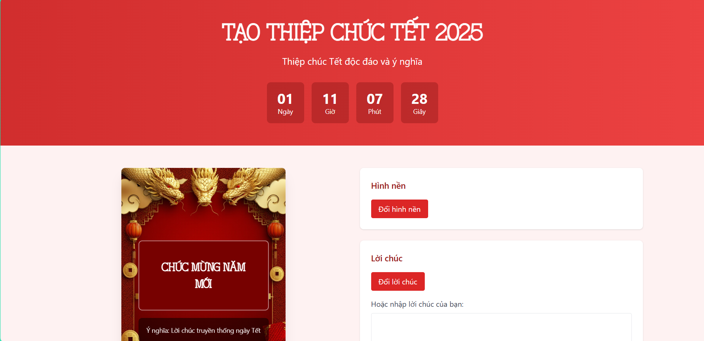
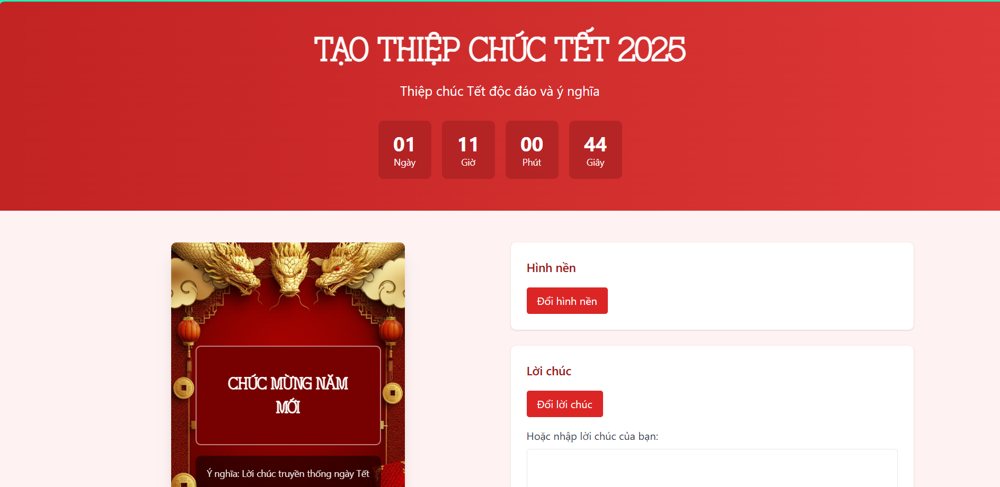
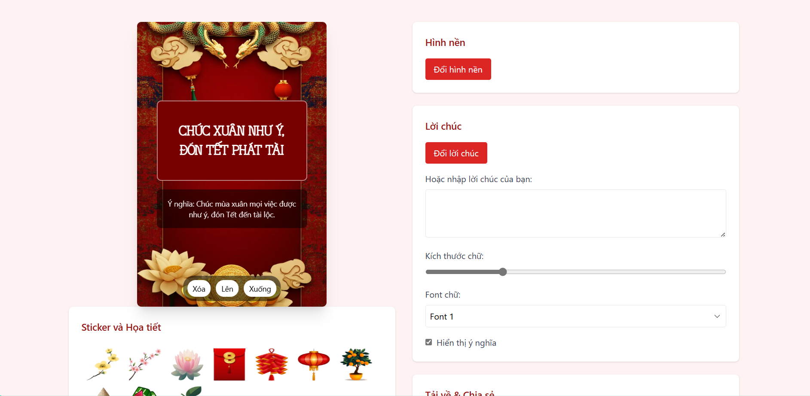
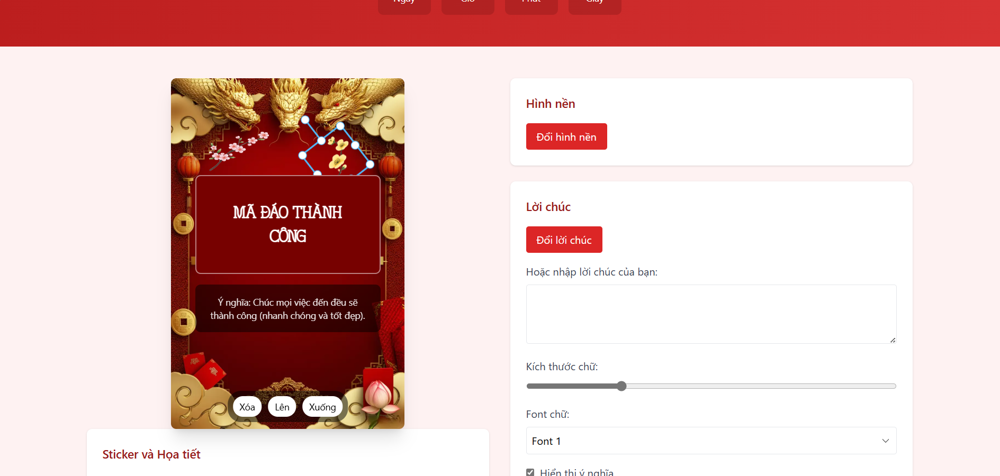

# 🎊 Thiệp Chúc Tết 2025 - Năm Ất Tỵ

<div align="center">
  
  
  [](https://bnatlu.id.vn)
  [](LICENSE)
</div>

## ✨ Tổng Quan

Thiệp Chúc Tết 2025 là một ứng dụng web tương tác cho phép người dùng tạo thiệp chúc Tết độc đáo và ý nghĩa. Với giao diện thân thiện và nhiều tính năng sáng tạo, ứng dụng giúp bạn dễ dàng tạo ra những tấm thiệp chúc Tết đẹp mắt để gửi đến người thân và bạn bè.

## 🌟 Tính Năng Chính

- **Thay Đổi Hình Nền**: Nhiều mẫu hình nền Tết đẹp để lựa chọn
- **Lời Chúc Đa Dạng**: 40+ mẫu lời chúc ý nghĩa kèm giải thích
- **Tùy Chỉnh Font Chữ**: 3 font chữ đặc biệt dành cho dịp Tết
- **Trang Trí Sticker**: Bộ sưu tập sticker phong phú với các họa tiết Tết truyền thống
- **Tải Về & Chia Sẻ**: Dễ dàng lưu và chia sẻ thiệp với độ phân giải cao

## 🛠️ Công Nghệ Sử Dụng

- HTML5 & CSS3
- JavaScript (ES6+)
- Tailwind CSS
- Fabric.js
- HTML2Canvas

## 🚀 Tối Ưu Hiệu Suất

- Sử dụng WebP cho preview ảnh
- Lazy loading cho stickers
- Font loading tối ưu
- Responsive design
- Touch-friendly interface

## 📱 Tương Thích

- Desktop: Chrome, Firefox, Safari, Edge
- Mobile: iOS Safari, Android Chrome
- Tablet: iPad OS, Android tablets

## 🏃‍♂️ Chạy Dự Án

1. Clone repository:
```bash
git clone https://github.com/NgaoPhongVan/AtTy2025.git
```

2. Mở file index.html hoặc sử dụng local server:
```bash
# Sử dụng Python
python -m http.server 8000

# Hoặc PHP
php -S localhost:8000

# Hoặc Node.js
npx http-server
```

3. Truy cập `https://ngaophongvan.github.io/AtTy2025/`

## 📸 Ảnh Demo

<div align="center">
  
  
  
</div>

## 🤝 Đóng Góp

Mọi đóng góp đều được chào đón! Hãy:

1. Fork dự án
2. Tạo branch mới (`git checkout -b feature/AmazingFeature`)
3. Commit thay đổi (`git commit -m 'Add some AmazingFeature'`)
4. Push lên branch (`git push origin feature/AmazingFeature`)
5. Mở Pull Request

## 👏 Credits

- Tác giả: Lê Văn Thuận - Ngạo Phong Vân
- Font chữ: [Hoa Sen Typeface](https://www.dafontvn.com/2024/06/hoa-sen-typeface.html), [TP Frauen](https://www.dafontvn.com/2024/01/font-viet-hoa-tp-frauen-2-font.html)

## 📬 Liên Hệ

Le Van Thuan - [Facebook](https://www.facebook.com/ngao.phong.van) - thienle1247@gmail.com

Project Link: [Ất Tỵ 2025](https://github.com/NgaoPhongVan/AtTy2025)

---
<div align="center">
  <i>Chúc mừng năm mới - Ất Tỵ 2025 🐍</i>
</div>